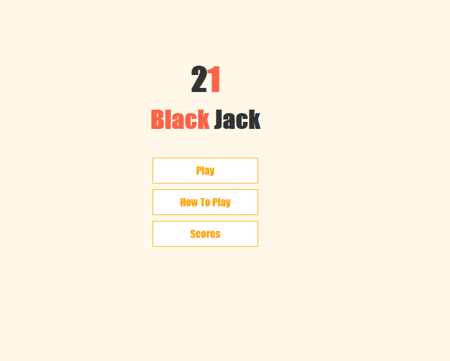
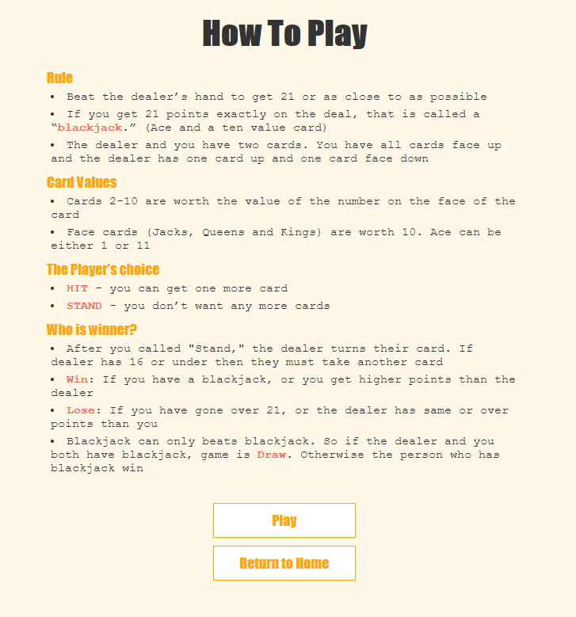

# Title: BlackJack 21
Website [LINK](https://antoniobaciu.github.io/js-21-card-game/)

Short introduction:
[BlackJack 21] is an simplified version of the original BlackJack game since it's single player,
and doesn't have a betting system.
In other words, the winner is decided only by it's score and there is no reward for winning
bersides the "You won !!!" message.

__The Game Rules:__

__Features:__

- [x] Score counter
- [x] Dedicated page for the score that will always store the win/lose history
- [x] Dedicated page for the game rules
- [x] New Game button in form of a card
- [x] Modal that informs the user who won/lost and provides the choice of going back to the main page/checking the score history or keep playing. 
